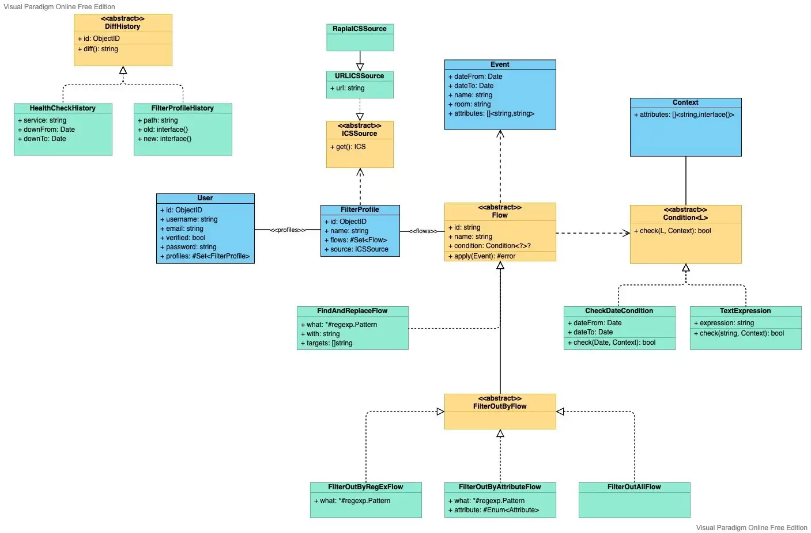

# Introduction

## Purpose

This software architecture document provides a comprehensive overview of the architecture of the project RALF. It serves as a communication medium between the software architect and other project team members regarding architecturally significant decisions which have been made.

## Scope

This document defines the architecture of RALF.

## Definitions, Acronyms and Abbreviations

- `RALF`: Room And Lecture Filtering [Proxy]
- `SRS`: Software Requirement Specification

## Overview

- [Architectural Representation](#architectural-representation)
- [Architectural Goals and Constraints](#architectural-goals-and-constraints)
- [Use-Case View](#use-case-view)
  - [Use-Case Realizations](#use-case-realizations)
- [Logical View](#logical-view)
  - [Overview](#overview)
  - [Architecturally Significant Design Packages](#architecturally-significant-design-packages)
- [Process View](#process-view)
- [Deployment View](#deployment-view)
- [Implementation View](#implementation-view)
  - [Overview](#overview)
  - [Layers](#layers)
- [Data View](#data-view)
- [Size and Performance](#size-and-performance)
- [Quality](#quality)

---

# Architectural Representation

The basic architecture is split into the service:

- Auth Service
- ... other ...

---

# Architectural Goals and Constraints

1. **High Availability:** RALF must be able to handle a high volume of requests and maintain a high level of uptime. 
2. **Security:** RALF must be secure and protect user data from unauthorized access. 
3. **Scalability:** RALF must be able to scale to meet the needs of its users. 
4. **Performance:** RALF must be able to process requests quickly and efficiently. 
5. **Flexibility:** RALF must be able to easily adapt to changing requirements. 
6. **Reliability:** RALF must be reliable and able to handle unexpected errors. 
7. **Usability:** RALF must be easy to use and understand. 
8. **Portability:** RALF must be able to run on multiple platforms. 
9. **Reusability:** RALF must be designed to be easily reused and extended. 
10. **Design and Implementation Strategy:** RALF must be designed and implemented using best practices and industry standards. 
11. **Schedule:** RALF must be developed within a reasonable timeframe. 

---

# Use-Case View

The following use-cases are found in RALF:

- Login/Register
- Create/View/Edit/Delete Filter Profiles

## Use-Case Realizations

See [SRS](https://srs.ralf.life/)

---

# Logical View



---

# Process View


---

# Deployment View


---

# Implementation View

## Overview

RALF consists of the 4 layers:

- Core
- Frontend
- API (/Engine)
- Infrastructure 

## Layers

Our layer engineer sadly has no access to internet 
because he is fighting in a civil war in Northern Africa.
(and because he's on vacation lol)

---

# Data View

Since we don't use a relational DBMS (MongoDB), we can't provovide you with an ER diagram. However, we can give you some example data:


<details>
    <summary>Filter Profile</summary>

```json
{
  "name": "Rename 'Heinrich Braun' to 'Heinrich' and only include Mondays after 9 o' clock",
  "cache-duration": "5m",
  "flows": [
    {
      "if": "true",
      "then": [
        {
          "debug": "true 1 ok"
        },
        {
          "if": "true",
          "then": [
            {
              "debug": "true 2 ok"
            },
            {
              "if": "true",
              "then": [
                {
                  "debug": "true 3 ok"
                }
              ]
            }
          ]
        }
      ],
      "else": [
        {
          "debug": "ok schade"
        }
      ]
    },
    {
      "do": "filters/filter-out"
    },
    {
      "do": "actions/regex-replace",
      "with": {
        "match": "(?:Braun\\,\\s*(Heinrich))|(?:(Heinrich) Braun)",
        "case-sensitive": false,
        "replace": "Braun \"$1\"",
        "in": [
          "title",
          "description"
        ]
      }
    },
    {
      "if": "Date.isWeekend()",
      "then": [
        "return"
      ],
      "else": [
        "return"
      ]
    },
    {
      "if": "(Date.isMonday() or Date.isTuesday()) and Date.isAfter(\"9:00\")",
      "then": [
        {
          "do": "filters/filter-in"
        }
      ]
    }
  ]
}
```

</details>

<details>
    <summary>User</summary>

```json
{
    "_id": "fefefefe-fefe-fefe-fefe-fefefefefefe",
    "username": "wikwaklhackldackl",
    "name": {
        "first": "Luca",
        "last": "Wikwak"
    },
    "email": "steckplatz.vier09@icloud.com",
    "password": "1$1fefefefefefefefefefefefefefefefefe",
    "address": {
        "street": "Am Neuen ICE Bahnhof",
        "nr": 14,
        "extra": null,
        "zc": 187420,
        "st": "BW"
    }
}
```

</details>


<details>
    <summary>Engine Log</summary>

```json
{
    "_id": ObjectID(...),
    "date": ...,
    "profile_id": ObjectID(...),
    "result": {
        "src": {
            "sc": 200,
            "cl": 187112,
            "mt": "text/calendar"
        },
        "out": {
            "sc": 200,
            "cl": 7013,
            "mt": "text/calendar",
            "contents": Base64(...)
        }
    }
}
```
</details>

---

# Size and Performance

Our main objective is to achieve the best UX possible and to avoid long waiting times that could potentially create issues in calendar software. 
We plan to keep the frontend performance efficient by simplifying the logic and reducing the design choices that could affect its performance. Since the backend is responsible for data processing and question generation, we can expect some size and performance issues. To overcome this, we will use auto-scaling and continuous performance monitoring.
Additionally, our databases will scale with the amount of users and filter profiles, giving us the ability to increase our hardware if needed. To ensure the best user experience, we aim to keep the initial load and page load times as low as possible.

---

# Quality

In order to ensure the best user experience possible, we are committed to providing a superior quality of service. To safeguard user data, such as filter profiles, we maintain a secure database to avoid any potential user dissatisfaction. We have implemented an architectural pattern that allows for portability, allowing users to access our services from both their mobile devices and personal computers. Additionally, the application view will automatically adjust to fit the size of the device being used.